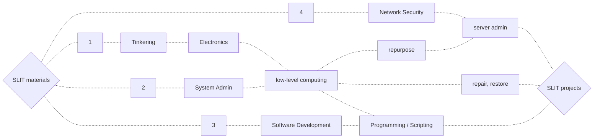
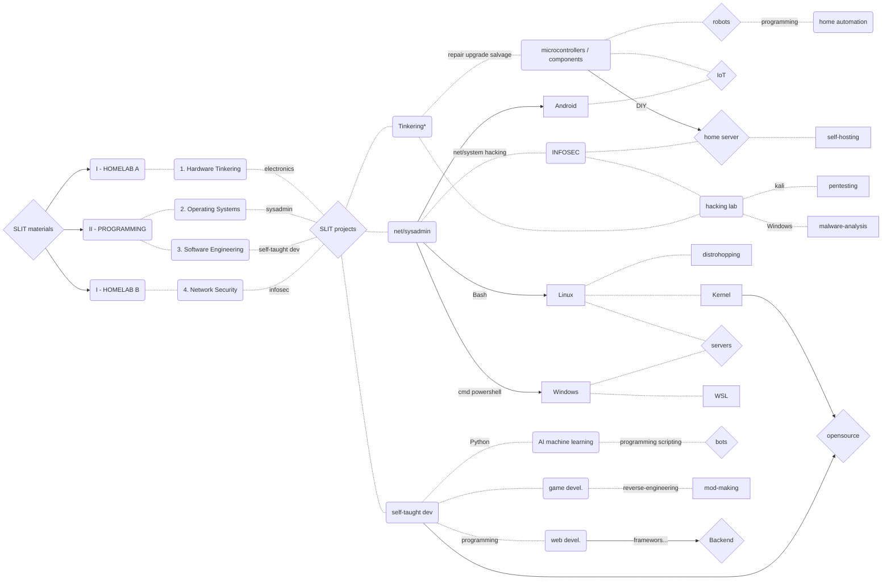

# *Self-Learning IT* ~ materials & projects

> WORK-IN-PROGRESS

## Breakdown

- [docs/](/docs/)
  - WIP-REWORK.md 
- scripts/
  - [1-bashCustomScripts](/scripts/1-bashCustomScripts/)
  - [2-bashNetworkChuck](/scripts/2-bashNetworkChuck/)
  - [3-bashGen](/scripts/3-bashGen/)
- src/
  - [1-pythonTerminalGames](/src/1-pythonTerminalGames/)
  - [2-pygameTea-Invaders](src/2-pygameTea-Invaders/)
  - [3-flaskDevWebsite](/src/3-flaskDevWebsite/)

## Doodles

- **SLIT MATERIALS**

- **SLIT PROJECTS (2022)**

