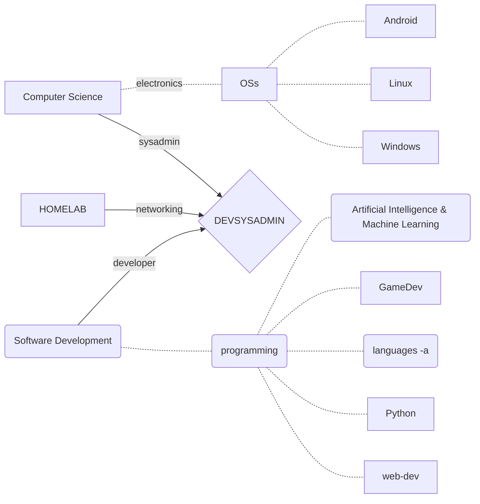
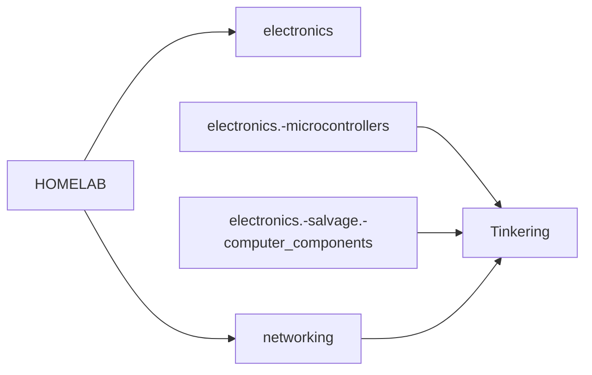

# *Self-Learning IT* ~ materials & projects


All general learning materials are on display [below](#slit-materials-taglist) on this **readme** file. [SLIT-materials](/SLIT-materials).

Now $devsysadmin$ projects are showcased and documented in [SLIT-projects](/SLIT-projects).
- 02-Hardware_Tinkering
- 04-Op_Systems_admin
- 05-CODE_Programming

lorem ipsum

- [*Self-Learning IT* ~ materials & projects](#self-learning-it--materials--projects)
- [DELETE: *all graphs*](#delete-all-graphs)
- [*SLIT-materials* taglist(rows)](#slit-materials-taglistrows)


# DELETE: *all graphs*

1. ## SLIT graph

```mermaid

graph LR;


SLIT{SLIT}

SLIT --> T
T[Tinkering]
T.- |security| N
T .- |repair-salvage| E


E[electronics]
E .- |smart DIY| H
N[networking]
N .- |NAS| H


H{HOMELAB}
H .- |robotics| automation
H .- |malware| hacking-lab
H .- |self-hosting| home-server
H --> 2022


2022{pabloqpacin 2022+}
D --> 2022
D{DEVSYSADMIN}
D .- |Python| AI(artificial intelligence)
D .- |reverse engineering| game(gamedev/modding)
D .- |frameworks| web-dev


SLIT --> P
P[Programming]
sysadmin[sysadmin]
SD[software dev.]


P .- |OS config| sysadmin
P .- |languages| SD

sysadmin .- |shell dev.| D
SD .- |backend| D


```


2. ## ↓ DEVSYSADMIN




3. ## ↑ HOMELAB-short



4. ## ↑ HOMELAB-long


5. ## ↑ HOMELAB-devices


# *SLIT-materials* taglist(rows)

