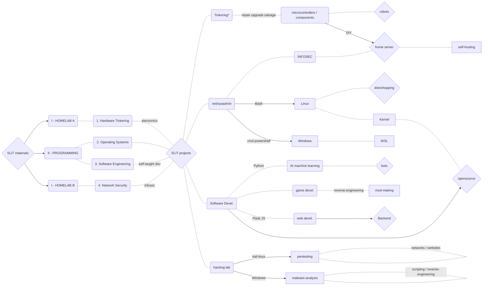

# *Self-Learning IT* ~ materials & projects

For general learning materials see [SLIT-materials]().

For actual projects see [SLIT-projects](/SLIT-projects/readme.md).

Observe the graphs below to understand the scope of SLIT and see [graphs-sandbox]

## *SLIT materials* visualized

## *SLIT projects* visualized

