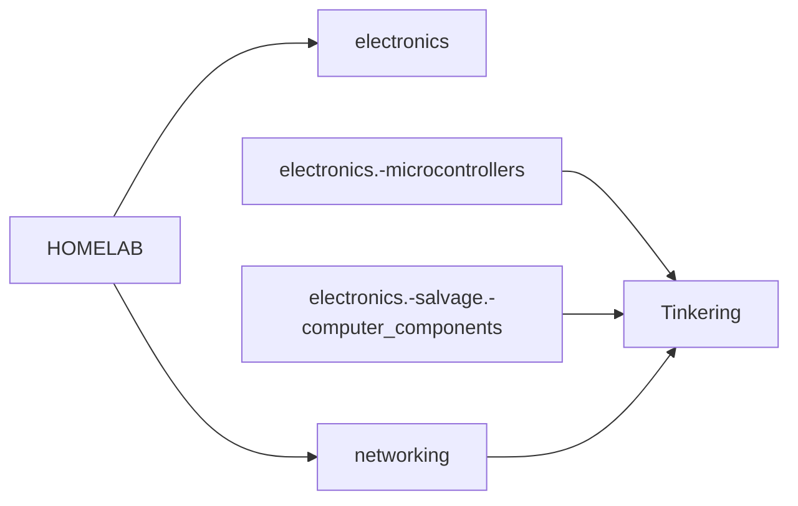
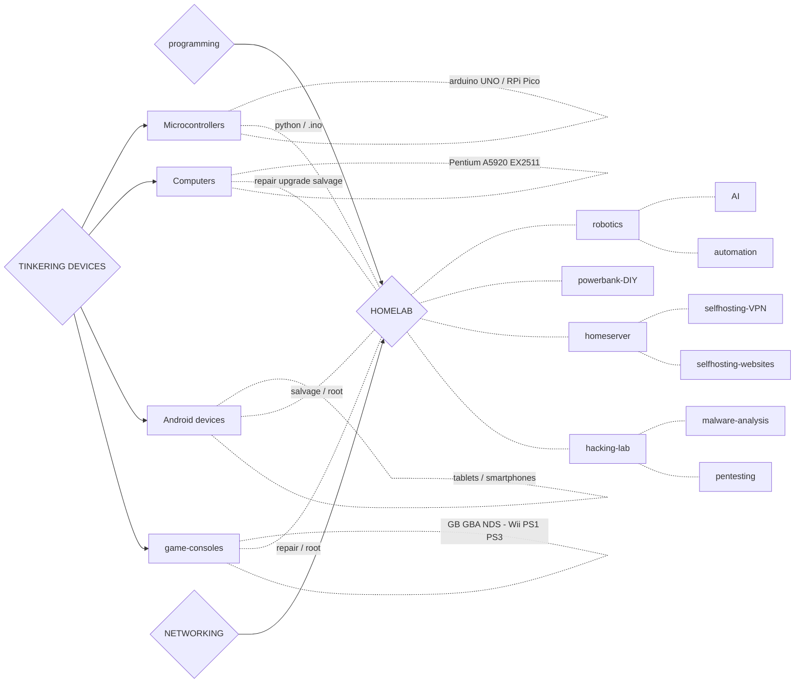
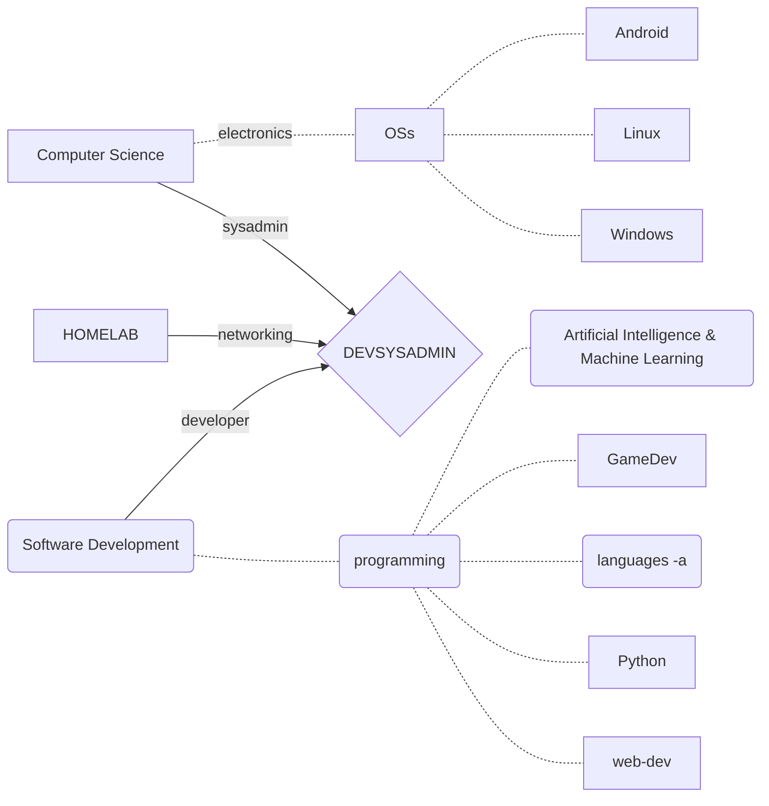

# *SLIT materials*

## Overview Graph


```mermaid

graph LR;


SLIT{SLIT}

SLIT --> T
T[Tinkering]
T.- |security| N
T .- |repair-salvage| E


E[electronics]
E .- |smart DIY| H
N[networking]
N .- |NAS| H


H{HOMELAB}
H .- |robotics| automation
H .- |malware| hacking-lab
H .- |self-hosting| home-server
H --> 2022


2022{pabloqpacin 2022+}
D --> 2022
D{DEVSYSADMIN}
D .- |Python| AI(artificial intelligence)
D .- |reverse engineering| game(gamedev/modding)
D .- |frameworks| web-dev


SLIT --> P
P[Programming]
sysadmin[sysadmin]
SD[software dev.]


P .- |OS config| sysadmin
P .- |languages| SD

sysadmin .- |shell dev.| D
SD .- |backend| D


```

1. # HOMELAB (short): Hardware Tinkering + Network Security
 



|$HOMELAB$|`homelab`|||`hardware` `networking`
|---|---|---|---|---|
|[ ]|`.`|[What is a HomeLab and How Do I Get Started](https://youtu.be/gPGf4Y8nQqM)|Techno Tim
|[ ]|`.`|[What is a HomeLab? How can you build your own and why it's useful](https://youtu.be/4O_MxTPmah4)|IT Career Questions
|[ ]|`.`|[HomeLab Tools & Accessories - Network / Server/ PC Tool Kit](https://youtu.be/VX2dxFkahgs)|Techo Tim|*toolkit*
|[ ]|`networking`|[Tour of Home Network](https://youtu.be/Ev0PL892zSE)|The 8-Bit Guy
|[ ]|`server`|[What's on my Home Server? MUST HAVE Services!](https://youtu.be/c4rKWrH88F0)|Tech Hut
|$electronics$||||`electronics`
|---|---|---|---|---|
|[ ]|`.`|[How Electricity works](https://youtu.be/mc979OhitAg)|Engineering Mindset
|[ ]|`.`|[Basic Electricity - What is an amp?](https://youtu.be/8gvJzrjwjds)|Afrotechmods
|[ ]|`.`|[Essential Tools that you will need for creating electronics projects!](https://youtu.be/7-djg27lJyQ)|GreatScott!| `toolkit` // **Black Friday (?)**
|[ ]|`.` `networking`|[How Firewalls Work](https://youtu.be/VS6An2WZ51k)|Mental Outlaw
|[ ]|`.` `networking`|[Network Ports Explained](https://youtu.be/g2fT-g9PX9o)|PowerCert Animated Videos
|[ ]|`circuits`|[How to Use a Breadboard](https://youtu.be/6WReFkfrUIk)
|[ ]|`circuits`|[Electronic components](https://youtu.be/6Maq5IyHSuc)|bigclivedotcom
|[ ]|`circuits`|[Why Are Circuits on Boards?](https://youtu.be/6je0Ea-jGlI)|Zack Freedman
||
|$(microcontrollers,$|`microcontrollers`|||`programming`
|[ ]|`.`|[A Hacker's Guide to Programming Microcontrollers, Tutorial](https://youtu.be/XlFO5Iat178)|Null Byte
|[ ]|`.` `RPico`|[Pico Prototyping - Building a "Pico Uno"](https://youtu.be/jwIOxOzee0U)|DroneBot Workshop
|[ ]|`arduino`|[5 best kits 2022](https://youtu.be/huKV8hdhsiY)||kits
|[ ]|`arduino`|[Arduino based Guitar Tuner](https://youtu.be/tjKySKeDoCE)
|[ ]|`arduino`|[learn Arduino in 15 minutes](https://youtu.be/nL34zDTPkcs)
|[ ]|`arduino`|[Arduino Course for Beginners](https://youtu.be/zJ-LqeX_fLU)|freeCodeCamp.org
|[ ]|`arduino`|[15 Great Arduino Projects for beginners](https://youtu.be/Ox-9eOc3bQU)|Maker Tutor
|[ ]|`arduino` `UNO`|[What is Arduino UNO](https://youtu.be/_ItSHuIJAJ8)
|[ ]|`arduino` `RPico`|[Arduino vs Pico - Which is the Best Microcontroller For You?](https://youtu.be/dOa3570JM2M)|Gary Explains
|[ ]|`RPico`|[Raspberry Pi Pico](https://youtu.be/peLH-HNza44)|ExplainingComputers
|[ ]|`RPico`|[Raspberry Pi Pico W: Wireless Weather Station](https://youtu.be/3q807OdvtH0)|ExplainingComputers
|[ ]|`RPico` `hack`|[Bad USBs are SCARY!! (build one with a Raspberry Pi Pico for $8)](https://youtu.be/e_f9p-_JWZw)|Network Chuck|`SECURITY`
|[ ]|`RPico` `python`|[RPi PICO // Starting with MicroPython + Examples](https://youtu.be/zlKJ5hvfs6s)|Electronoobs|`PROGRAMMING`
|### $SBCs,$|`sbc`|||single-board computers
|[ ]|`RPi`|[Choosing the right Raspberry Pi for you!](https://youtu.be/YAs1qdgiqPc)|Android Authority
|### $computer-components)$| `low-level`
|[ ]|`.`|[How are Microchips made?](https://youtu.be/bor0qLifjz4)
|[ ]|`.`|[How Do Computers Remember](https://youtu.be/I0-izyq6q5s)|Sebastian Lague
|[ ]|`.`|[From Transistors to Tetris P.1](https://youtu.be/6caLyckwo7U)
|[ ]|`.`|[Jamás Entenderás Cómo Funciona un PC al 100%](https://youtu.be/iOQnZKJ3fls)|Antonio Sarosi|**ojo**
|[ ]|`.` `gamedev`|[Fixing the Entire SM64 Source Code (Insane N64 performance)](https://youtu.be/t_rzYnXEQlE)|Kaze Emanuar| `gamedev` // ON Discord
|[ ]|`bluetooth`|[How does Bluetooth Work?](https://youtu.be/1I1vxu5qIUM)|Branch Education
|[ ]|`CPU`|[CPU Clock Speed Explained](https://youtu.be/3PcO10iAXTk)|Max's Tech
|[ ]|`CPU`|[How CPUs read machine code](https://youtu.be/yl8vPW5hydQ)||`machine_code`
|[ ]|`graphics`|[How are Images Compressed? JPEG In Depth](https://youtu.be/Kv1Hiv3ox8I)|Branch Education
|[ ]|`memory`|[How do Computers Work? Exploring Computer Main Memory DRAM DDR5](https://youtu.be/7J7X7aZvMXQ)|Branch Education| quality dawg
|[ ]|`MOBO`|[Motherboards Explained](https://youtu.be/b2pd3Y6aBag)|PowerCert Animated Videos
|[ ]|`storage` `ssd`|[How do SSDs/Smartphones work?](https://youtu.be/5Mh3o886qpg)|Branch Education
||
||
|$TINKERING$|||||
|---|---|---|---|---|
|[ ]|`.`|[17 DIY inventions](https://youtu.be/twKkQaORKS4)
|[ ]|`.`|[How to Clean a Laptop](https://youtu.be/bypESzEtZr4)
|[ ]|`.`|[How I Made my own Smart Glass Under $10](https://youtu.be/pkB1Nahi-X0)|DD ElectroTech
|[ ]|`.`|[Hacking Dystopia with a Pi 400 Cyberdeck](https://youtu.be/guGffGw3uDg)|Zack Freedman
|[ ]|`.`|[$15 Drone Build within 24 Hours - Challenge](https://youtu.be/FHk5PEZAyMA)|DD ElectroTech
|[ ]|`.` `arduino`|[Turning a car into a COMPUTER MOUSE](https://youtu.be/M2xqMZ6b85w)|William Osman
|[ ]|`.` `GL76`|[MSI-GL76 Dissassembly](https://youtu.be/DF4HVW6Y_Fk)
|[ ]|`.` `networking`|[Should You Build Your Own Router?](https://youtu.be/Yq9NtTS90AE)|Wolfgang's Channel|`DIY-router`
|[ ]|`.` `networking`|[Routers Suck. Build Your Own Instead!](https://youtu.be/am7xT-zU1Q0)|Techquickie|`DIY-router`
|[ ]|`.` `repurpose`|[How I Transform OLD TV into Smart TV - Voice Controlled](https://youtu.be/Xzd5CG4Nn2c)|DD ElectroTech
|[ ]|`.` `restore`|[Electronic Pinball Restoration](https://youtu.be/jh9dNaRqEpg)|Odd Tinkering
|[ ]|`.` `restore`|[Mining Lantern rest. -numismatics-](https://youtu.be/hqc0pQ7DV4I)|TysyTube
|[ ]|`.` `server`|[How to build a Budget Home Server and WHY You Should](https://youtu.be/irW0AiRED3w)|Zach's Tech Turf
|[ ]|`.` `server`|[Incredible Budget Home Server! (Minecraft, Plex, Home Assistant, NAS)](https://youtu.be/72D3MvPk3Xs)|Hardware Haven
|[ ]|`.` `VPN` `RPi`|[Set Up Your Own VPN at Home With Raspberry Pi! (noob-friendly)](https://youtu.be/rtUl7BfCNMY)|Wolfgang's Channel
|[ ]|`.` `wiimote`|[Wii Remote Working on PS5 (How-to)](https://youtu.be/BjgCvOfQek8)|Basically Homeless
|[ ]|`Pentium` `!BIOS`|[Computer BIOS in Pentium4 MOBO](https://youtu.be/TuG2rsrI_tc)
|[ ]|`Pentium`|[Build Retro PC from New Old Parts](https://youtu.be/xKChxv9jw74)
|[ ]|`Pentium`|[This PC Wasn't Worth Saving; Pentium 4 Build](https://youtu.be/sjfe9cQky5g)|Tech Made Easy
|[ ]|`Pentium` `restore`|[Pentium III Restoration](https://youtu.be/eSYOH_AfgEY)
|[ ]|`Pentium` `restore`|[Restoring old Windows XP](https://youtu.be/1p5RUI9hIF8)|Psivewri|`windows`
|[ ]|`Pentium` `restore`|[This Pentium III hasn't been cleaned in 15 years](https://youtu.be/UyVHrxYZJJI)|Phils Computer Lab
|[ ]|`Pentium` `upgrade`|[Using Pentium 4 in 2020 with Windows 10](https://youtu.be/sSZNLAIL65M)|Phils Computer Lab|`windows`
|[ ]|`repurpose`|[Repurpose your old dead Laptop](https://youtu.be/WLP_L7Mgz6M)
|[ ]|`repurpose` `server`|[Your old PC is your new Server](https://youtu.be/zPmqbtKwtgw)|Linux Tech Tips
|[ ]|`repurpose` `server`|[Convert an old PC to a Home Server using Unraid - SMB, Terraria, HomeAssistant, Jellyfin](https://youtu.be/7h0JVS0en3U)|Hardware Haven
|[ ]|`repurpose` `server`|[How to build a DIY NAS from an OLD PC // Budget TrueNAS](https://youtu.be/FN3NhrD3KWo)|Torogi Pro
|[ ]|`repurpose` `server`|[Turn Old Computer into a NAS with FreeNas!](https://youtu.be/OUz5vC0IZX4)|Torogi Pro
|[ ]|`repurpose` `server`|[Setting up an old laptop as a NAS](https://youtu.be/ZInPE-sG0Ug)|Electronics Wizardry
|[ ]|`repurpose` `server`|[Turning an OLD PC/Laptop into a Media Server! (Ubuntu/PLEX Guide)](https://youtu.be/lXcfKTNObOo)|Tech Hut
|[ ]|`repurpose` `server`|[Turn an old PC into a powerful NAS solution using UNRAID!](https://youtu.be/r9n4hMFBqvo)|The Bear Tech
|[ ]|`restore`|[FREE BROKEN Laptop - But Can I Fix It? Acer Nitro 5 No Power](https://youtu.be/C4S6QL4keOQ)|Tronics Fix
|[ ]|`restore` `HDD`|[Fix your Hard Drive](https://youtu.be/zAMjdrUf9V4)
|[ ]|`restore` `MOBO`|[Laptop Motherboard -Diagnose,Repair-](https://youtu.be/GCLflqmne6k)
|[ ]|`smartabs` `restore`|[OEM/ODM 7 Inch Tablet PC Touch Screen Replacement Disassembly Repair Guide](https://youtu.be/LeaulreONq0)|ivifix.com
|[ ]|`smartphones` `repurpose`|[10 GENIUS Ways to Reuse Your Old Smartphone](https://youtu.be/k2_qM7NF_Vg)|C4ETech English
|[ ]|`smartphones` `repurpose`|[What is worth salvaging from an old smartphone](https://youtu.be/dYnplx_DVHs)|Great Scott!
|### $consoles$
|[ ]|`GameBoy` `restore/upgrade`|[Gameboy Restored & Upgraded](https://youtu.be/lMyb0erNuCE)|Odd Tinkering
|[ ]|`NES` `restore`|[I Bought 7 BROKEN NES Games - Let's Try To Fix Them](https://youtu.be/nDW8P0mP4qI)|TronicsFix
|[ ]|`PS1` `restore/upgrade`|[PS1 Restoration & Upgrade](https://youtu.be/eMUpTVMqueY)|Odd Tinkering
||


## ***Tinkering Devices for HOMELAB***



---

2. # DEVSYSADMIN

Deprecated graph:




## `Computer Science & Software Development STUDIES`


(for `gamedev`, `comm.` stands for *'gamedev community'* YAY!)

|# $DEVSYSADMIN$|`devsysadmin`||||
|---|---|---|---|---|
||
|## $CS$ *&* $Software Dev.$|
|[ ]|`.`|[Computer Science - Crash Course](https://www.youtube.com/playlist?list=PLH2l6uzC4UEW0s7-KewFLBC1D0l6XRfye)|Crash Course
|[ ]|`.`|[An entire CS Degree in 12 minutes](https://youtu.be/EJiVWoFk8GA)
|[ ]|`.`|[100+ Computer Science Concepts Explained](https://youtu.be/-uleG_Vecis)|Fireship
|[ ]|`.`|[4º de Ingeniería Informática en 15 Minutos](https://youtu.be/_mKjNeb1lM4)|Antonio Sarosi
|[ ]|`.`|[Licenciatura en Ciencias de la Computación (UBA)](https://youtu.be/sLMsRewMTVk)|Santi Fiorino
|[ ]|`browser` `DDG`|[BYE DuckDuckGo, here's my new search engine! Private Alternatives to Google](https://youtu.be/x9q3qPxrTqg)|The Linux Experiment|`privacy`
|[ ]|`browser` `Google`|[How Google Search Works (in 5 minutes)](https://youtu.be/0eKVizvYSUQ)|Google
|[ ]|`Cloud`|[Cloud Computing Explained](https://youtu.be/_a6us8kaq0g)|PowerCert Animated Videos
|[ ]|`devops`|[DevOps Explained](https://youtu.be/Xrgk023l4lI)|Simplilearn
|[ ]|`opensource`|[Contributing to Open Source can change your life](https://youtu.be/CML6vfKjQss)
|[ ]|`opensource`|[How to Contribute to Open Source - Complete Guide](https://youtu.be/yzeVMecydCE)|freeCodeCamp + Eddie Jaoude
|[ ]|`shell`|[Bash vs ZSH vs Fish: What's the Difference?](https://youtu.be/dRdGq8khTJc)|Eric Murphy|`fish` `zsh`
|[ ]|`shell`|[What's so great about the Fish Shell?... I'll tell you...](https://youtu.be/xy38NNzufuE)|linux dabbler|`fish`
|[ ]|`shell`|[Diferencias entre Bash vs ZSH vs Fish?](https://youtu.be/Mx968FklOYc)|CodelyTV-Redescubre la programación|`fish` `zsh`
||
|## $sysadmin—OSs($|||||
|---|---|---|---|---|
|[ ]|`.`|[Types of OSs afap](https://youtu.be/MR2ntdZW__A)|Techquickie
|[ ]|`.` `dual-boot`|[The Best Way do Dual Boot Windows and Ubuntu](https://youtu.be/CWQMYN12QD0)|Techno Tim
|[ ]|`.` `Windows`|[I put Windows 10 on a Calculator - Stupid Setups](https://youtu.be/neD9_viUnS8)|Basically Homeless|`LMAO`
|[ ]|`BIOS` `UEFI`|[BIOS, CMOS, UEFI - What's the difference?](https://youtu.be/LGz0Io_dh_I)|PowerCert Animated Videos
|[ ]|`BIOS` `UEFI`|[BIOS and UEFI afap](https://youtu.be/zIYkol851dU)|Techquickie
|[ ]|`job-sysadmin`|[Staying Happy in System Administration](https://youtu.be/dGJlUoCTb6M)|USENIX|40min.
|[ ]|`job-sysadmin`|[How to Be a Great System Adminstrator in 3 Steps](https://youtu.be/Biz_QnigwWI)|IT Career Questions
|[ ]|`job-sysadmin`|[How it FEELS to be a SysAdmin (What is a System Administrator)](https://youtu.be/v9bZsmn-Aw4)|Sir Sudo
|[ ]|`ventoy`|[Ventoy - An Easy to Use MultiBoot USB Tool](https://youtu.be/K64sT0pQc-0)|Mental Outlaw
|[ ]|`ventoy`|[How to create the ULTIMATE multiboot flash drive using Ventoy!](https://youtu.be/7eQciSP91eI)|Alfredo Sequeida
|[ ]|`ventoy`|[How to Create a Multiboot USB with Ventoy // Fast, Simple and Easy Guide](https://youtu.be/z1FyoCswwAc)|Techno Tim
|[ ]|`virtualization`|[Ditch Virtualbox, Get QEMU/Virt Manager](https://youtu.be/wxxP39cNJOs)|Mental Outlaw|`QEMU`
|[ ]|`virtualization`|[Stop using Virtualbox, Here's how to use QEMU instead](https://youtu.be/Kq849CpGd88)|Chris Titus Tech
|[ ]|`virtualization`|[20 Ways to Use a Virtual Machine (and other ideas for your homelab)](https://youtu.be/SVQmzaSabEQ)|Techno Tim|`HOMELAB`
|$(Android,$|
|[ ]|`.`|[**Calyx** OS - The next big Android Competitor?](https://youtu.be/qTtgzNGRAfA)|Mrwhosetheboss
|[ ]|`.` `Linux`|[Easily run Linux on Android with **AndroNix** - Linux Distro on Android without Root](https://youtu.be/jvuufPWKF3k)
|[ ]|`.` `Windows`?|[Cómo INSTALAR Windows 11 ARM // Iniciar DOS Sistemas ANDROID y Windows](https://youtu.be/VkI476sGI4s)
|[ ]|`root`|[What is Root Access on Android? How to Root](https://youtu.be/eR26901B_0A)
|[ ]|`root`|[Android 13 Custom ROM List: Unofficially update your Android Smartphone!](https://xda-developers.com/android-13-custom-rom-list)|XDA-Developers|website
|$Linux,$|
|[ ]|`.`|[Linux for the Absolute Beginner...](https://youtu.be/EN7mbRccT-8)|Low Dough Tech
|[ ]|`.`|[Bring Back Windows 95 with XFCE + Chicago](https://www.youtube.com/shorts/VcbzoOjMLHM)|Tech Hut|`Chicago95`
|[ ]|`.`|[7 Linux Terminal Application and Utilities](https://youtu.be/ZNNqkeeOdrk)|Tech Hut
|[ ]|`d-`|[From Noob to Power-User with MX Linux](https://youtu.be/IsnSSY2vTXQ)|Distro Tube
|[ ]|`d-`|[Top Five Arch-Based Linux Distros 2022](https://youtu.be/zkmTpxVpj6Q)|Distro Tube
|[ ]|`d-`|[What is the Best Linux Distro? -It's the one you Make the best](https://youtu.be/_f5uev7UTz0)|Mental Outlaw
|[ ]|`d-Arco`|[ArcoLinux - First Impressions and Install](https://youtu.be/S_dG79GhNfI)|Tech Hut
|[ ]|`d-Kali`|[Linux for Ethical Hackers (Kali Linux Tutorial)](https://youtu.be/lZAoFs75_cs)|freeCodeCamp|`SECURITY`
|[ ]|`d-Kali`|[Cómo instalar Kali Linux 2022 en VirtualBox y VMware](https://youtu.be/4lKQKxwjXbg)|The Good Hacker|`SECURITY`
|[ ]|`d-Mint`|[How good is Linux Mint for beginners](https://youtu.be/pNWDnJ_kESM)|The Linux Experiment
|[ ]|`d-Mint`|[20 Different Types of Linux Mint Themes](https://youtu.be/PIrl3Eb0H44)
|[ ]|`d-Mint`|[From Noob To Power User With Linux Mint Cinnamon](https://youtu.be/TKX29fJ8U2Y)|Distro Tube
|[ ]|`d-Manjaro`|[Manjaro is NOT Arch](https://youtu.be/VzAw8a3Jx-k)|Tech Hut
|[ ]|`d-Manjaro`|[MANJARO has a BIG PROBLEM](https://youtu.be/oVlD17OjFAc)|The Linux Experiment
|[ ]|`d-openSUSE`|[I Spent 90 days in openSUSE Tumbleweed, This Is What Happened!](https://youtu.be/Idx2_YXVvNE)|DASGeek|must trye
|[ ]|`d-openSUSE`|[5 Things You MUST DO After Installing OpenSUSE](https://youtu.be/ajVqJ1nl9bM)|TechHut
|[ ]|`d-openSUSE`|[OpenSUSE: A Beautiful Linux Distro](https://youtu.be/yf3b6b1iHIA)|ExplainingComputers
|[ ]|`d-PopOS`|
|[ ]|`kernel_dev`|[BIG TECH makes LINUX. Is that a problem?](https://youtu.be/7LfBSzi0Dp0)|The Linux Experiment
|[ ]|`kernel_dev`|[Kernel Linux(I) ¿Qué es el kernel de Linux](https://youtu.be/xJi7rIyLOrc)|Entropía Binaria
|[ ]|`kernel_dev` `Torvalds`|[Linus Torvalds On Future Of Desktop Linux](https://youtu.be/mysM-V5h9z8)|TFiR
|$Windows)$
|[ ]|`WSL`|[I Coded with WSL2 for a Week](https://youtu.be/LktFP0Dpl-c)|Forrest Knight
|[ ]|`WSL`|[BEST Web Dev Setup? Windows & Linux at the same time (WSL)](https://youtu.be/-atblwgc63E)|Fireship
||
||
|$PROGRAMMING$|||||
|---|---|---|---|---|
|[ ]|`.`|[Coding is NOT enough](https://youtu.be/1ES981Nywx0)|CoderCoder
|[ ]|`.`|[Coding Skills NO ONE Will Teach You](https://youtu.be/7qH8prh4hpE)|Tech With Tim
|[ ]|`.`|[Programar no es fácil: tienes que darle al coco](https://youtu.be/Pffxn91L__4)|Makigas
|[ ]|`.`|[Cómo MEJORAR en PROGRAMACIÓN (Y en ENTREVISTAS Técnicas)](https://youtu.be/14v4IINunvY)|MoureDevrais
|[ ]|`.` `android`|[Can you code on a phone? Android Mobile Programming Tutorial](https://youtu.be/VZ6LifcOXfM)|freeCodeCamp
|[ ]|`.` `good_practice`|[10 cosas que he aprendido en 7 años como Programador Freelance](https://youtu.be/vVMiKq0Ly1E)|MoureDevrais
|[ ]|`.` `good_practice` `debugging`|[Best Debuggin Tips for Beginners](https://youtu.be/gaminoBsQx0)|WebDevSimplified
|[ ]|`.` `history`|[What was Coding like 40 years ago?](https://youtu.be/7r83N3c2kPw)|The Coding Train
|[ ]|`.` `jobs`|[Developer Portfolio Do's and Don'ts](https://youtu.be/nlSgxeT2_dc)|Kenny Gunderman|**good advice**
|[ ]|`.` `jobs`|[How I Would Get My First Job If I Started Over](https://youtu.be/hW5s_UUO1RI)|ThePrimeagen|prepare & persevere
|[ ]|`.NET`|[What is .NET? // .NET COre 101 [1 of 8]](https://youtu.be/eIHKZfgddLM)|dot net
|[ ]|`algorithms`|[Using *Group Theory* to Speed Up *Algorithms*](https://youtu.be/KufsL2VgELo)|Nemean
|[ ]|`APIs`|[How Tom Scott & Mr. Beast use APIs to update their videos programmatically](https://youtu.be/JjXBrJfp5TE)|Fireship
|[ ]|`blockchain`|[Bitcoin in 100 Seconds // Build your Own Blockchain](https://youtu.be/qF7dkrce-mQ)|Fireship|mind 9min.
|[ ]|`databases`|[SurrealDB in 100 Seconds](https://youtu.be/C7WFwgDRStM)|Fireship
|[ ]|`Git`|[Git It? How to Use Git and GitHub?](https://youtu.be/HkdAHXoRtos)|Fireship
|[ ]|`Internet_speed`|[Is your Internet FAST enough?](https://youtu.be/2LOkI3Xyd_E)|Techquickie
|[ ]|`metaverse`|[I tried the Metaverse - Meta Quest Pro](https://youtu.be/lT1sps72_sE)|ShortCircuit (Linus)
|[ ]|`OOP`|[OOP is Embarrasing: 4 Short Examples](https://youtu.be/IRTfhkiAqPw)|Brian Will
|[ ]|`roadmap` `python`|[The Real Python Developer Roadmap](https://youtu.be/d5BzuLlII_Y)|Zero To Mastery
|[ ]|`terminal` `Windows`|[Windows Terminal NEW Features: v1.0 -> v1.15](https://youtu.be/hA4rGwT0nC4)|**ThioJoe**|mucho WINDOWS este pavo
|[ ]|`TDD`|[Software Testing Explained in 100 Seconds](https://youtu.be/u6QfIXgjwGQ)|Fireship
|[ ]|`TDD`|[Test-Driven Development // Fun TDD introduction with **JavaScript**](https://youtu.be/Jv2uxzhPFl4)|Fireship
|[ ]|`vim`|[My Favorite Vim Tricks](https://youtu.be/B-EPvfxcgl0)|Mack
|[ ]|`vim`|[VIM The Ultimate Editor](https://youtu.be/P88ydZVcm1s)|Chris Titus Tech
|[ ]|`vim`|[How to Become a VIM /G/od](https://youtu.be/3sUDa5GdCTI)|Mental Outlaw
|[ ]|`vscode`|[My VS Code Setup for Web Development](https://youtu.be/H2gvHxC9gFY)|Forrest Knight
|[ ]|`vscode`|[25 VSCode Productivity Tips and Speed Hacks](https://youtu.be/ifTF3ags0XI)|Fireship
|[ ]|`vscode`? `Jupyter_Notebooks`|[Get started with Jupyter Notebooks in 4 minutes](https://youtu.be/h1sAzPojKMg)|
|### $Art.Intelligence$ $Mach.Learning$|`ai` `ml`
|[ ]|`.`|[Deep Learning / Natural Language Processing / Machine Learning / Artificial Neural Networks / ...](https://levelup.gitconnected.com/top-7-deep-learning-methods-each-explained-in-less-than-10-seconds-3683120de455)|LevelUpCoding|`neural_networks`
|[ ]|`.`|[Why Neural Networks can learn (almost) anything](https://youtu.be/0QczhVg5HaI)|Emergent Garden|`neural_networks`
|[ ]|`.`|[Tu primera red neuronal - Inteligencia Artificial](https://youtu.be/UNFFLJPW7KQ)|Ringa Tech|`neural_networks` *HTML (?)*
|[ ]|`tensorflow`|[TensorFlow in 100 Seconds](https://youtu.be/i8NETqtGHms)|Fireship
|### $GameDev$|`gamedev`
|[ ]|`.`|[I Tried Creating a Game Using Real-World Geographic Data](https://youtu.be/sLqXFF8mlEU)|Sebastian Lague
|[ ]|`.` `Lua`|[Pokémon Coding Tutorial - CS50's Intro to Game Development](https://youtu.be/gx_qorHxBpI)|freeCodeCamp
|[ ]|`comm.` `GMTK`|[GMTK Game Jam 2022](https://youtu.be/XNCGdi2A6fQ)|Game Maker's Toolkit
|[ ]|`comm.` `itch.io`|[itch.io](https://itch.io/)
|[ ]|`comm.` `Miniplay`|[Miniplay > Devs](https://ssl.miniplay.com/dev/user/login)|Minijuegos (Devs)
|[ ]|`comm.` `reddit`|[reddit communities compiled lol](https://reddit.com)
|[ ]|`emulation`|[emudev's hub of Discord servers for ALL systems](https://emudev.org/discord_related)
|[ ]|`emulation` `GC`|[Emulation on Gamecube - NES, SNES, GBA, PS1 & more](https://youtu.be/_rYVWzjVWmw)|Blaine Locklair
|[ ]|`emulation` `ROMs`|[Zophar's Domain](https://www.zophar.net/)
|[ ]|`mod-making`|[Game Modding afap](https://youtu.be/4BB1HfvSqAI)|Techquickie
|[ ]|`retrogaming` `rev.eng.`|[Beginners Guide to Reverse Engineering (Retro Games)](https://www.retroreversing.com/tutorials/introduction)|Retro Reversing
|[ ]|`Unity`|[Unity in 100 Seconds](https://youtu.be/iqlH4okiQqg)|Fireship
|[ ]|`Unity`|[I wish I had known this before I started Unity Game Development](https://youtu.be/286SGzpUx9o)|But Why Levin
|[ ]|`Unity`|[Unity VS Unreal Engine 5; Which Engine is Best For Game Development?](https://youtu.be/iEJe9NIYGTs)|Skrelo
||
|### $languages$|`$`
|[ ]|`.`|[The Programming Language Guide](https://youtu.be/2lVDktWK-pc)|Traversy Media
|[ ]|`.` `scripting`|[Scripting Vs Programming; Differences between Scripting & Programming Languages](https://youtu.be/g0Q-VWBX5Js)|Intellipaat
|[ ]|AI|[IA aprende a jugar Dino (Chrome)](https://youtu.be/gC85en0Vmh4)|Santi Fiorino
|[ ]|AI, neural_networks|[NN Learns to Play Snake](https://youtu.be/zIkBYwdkuTk)|Greer Viau
|[ ]|`bash`|[Shell Scripting Tutorial -website-](https://shellscript.sh)||website
|[x]|`bash`|[Learn BASH right now!](https://youtu.be/SPwyp2NG-bE)|Network Chuck
|[x]|`bash`|[212 Bash Scripts](https://youtu.be/q2z-MRoNbgM)|LinuxHint 
|[ ]|`bash`|[Write Your Own Bash Scripts for Automation (Tutorial)](https://youtu.be/PPQ8m8xQAs8)|Null Byte
|[ ]|`C`|[C Tutorial: Full Course for Beginners](https://youtu.be/87SH2Cn0s9A)|Bro Code
|[ ]|`C`|[CLA course: an overview](https://cppinstitute.org/cla-course-an-overview)|C++ Institute | C/C++ Certification and Training Programs|*website*
|[ ]|`C`|[15+ Exciting C Projects Ideas With Source Code (2022)](https://www.interviewbit.com/blog/c-projects/?amp=1)|Interview Bit|*website*
|[ ]|`CSS`|[CodePen.io](https://codepen.io/kassandrasanch/pen/yLOOgNy)||website
|[ ]|`CSS`|[Reverse Engineer CSS Animations {Shorts}](https://youtu.be/ecl-eCbYFPM)|Fireship
|[ ]|`CSS`|[Can you beat me at a CSS Battle?](https://youtu.be/A0J-hB3kSQ4)|Kevin Powell
|[ ]|`JS`|[The Javascript Problem](https://youtu.be/VWY6J3sHKKQ)|Mental Outlaw| double-check
|[ ]|`JS` `ml`|[Self-Driving Car with JS (NNs, ML)](https://youtu.be/Rs_rAxEsAvI)|freeCodeCamp|AI+ML
|[ ]|`JS` `gamedev`|[Build a 2048 to level up your Game Development](https://youtu.be/wOVEe9eawXc)|WebDevSimplified|gamedev
|[ ]|`JS` `gamedev`|[JavaScript Game Development Course for Beginners](https://youtu.be/GFO_txvwK_c)|freeCodeCamp|gamedev
|[ ]|`Kotlin` `android`|[Java vs Kotlin for Android App Development](https://youtu.be/9wWgw9smBJs)|Keep On Coding
|[ ]|`Kotlin` `android`|[Learn Kotlin in 12 Minutes](https://youtu.be/iYrgWO2oibY)|Rahul Pandey
|[ ]|`Kotlin` `android`|[Kotlin: Curso Android desde Cero](https://youtu.be/ebQphhLpJG0)|MoureDevrais
|[ ]|`Kotlin` `android`|[JETPACK COMPOSE: Curso ANDROID KOTLIN desde CERO para PRINCIPIANTES](https://youtu.be/yVIGAvMO3bc)
|[ ]|`Node.js` `webdev`|[RESTful APIs in 100 Seconds // Build an API from Scratch with **Node.js Express**](https://youtu.be/-MTSQjw5DrM)|Fireship|`APIs`
|[ ]|`Rust`|[What can you build in Rust?!](https://youtu.be/MraEYwI9C5o)|Let's Get Rusty
||
|### $Python$|
|[ ]|`.`|[Master Python With These 5 Projects](https://youtu.be/N6tzhlilNZY)|Tech With Tim
|[ ]|`.`|[20 Python Projects For Beginners - Coding Course](https://youtu.be/-na-hnh_MCg)|Code With Tomi|hours3
|[ ]|`.`|[Turn An Excel Sheet Into An Interactive Dashboard Using Python (STreamlit)](https://youtu.be/Sb0A9i6d320)|Coding Is Fun
|[ ]|`.` `bot`|[Creating a Discord Bot in Python 3.9](https://youtu.be/fU-kWx-OYvE)|Indently|
|[ ]|`.` `bot`|[Code a Discord Bot with Python - Host for Free in the Cloud](https://youtu.be/SPTfmiYiuok)|freeCodeCamp|ai, bots
|[x]|`.` `Flask` `webdev`|[Python Website Full Tutorial - Flask, Auth, Databases & more](https://youtu.be/dam0GPOAvVI)|Tech With Tim|***YAY***
|[ ]|`.` `Flask` `webdev`|[Learn Flask for Python - Full Tutorial](https://youtu.be/Z1RJmh_OqeA)|freeCodeCamp.org
|[ ]|`.` `pygame`|[Pygame's Performance - what you need to know](https://youtu.be/hnKocNdF9-U)|DaFluffyPotato
|[ ]|`.` `PyAutoGUI`|[Python Automation with PyAutoGUI; full course with projects](https://youtu.be/3PekU8OGBCA)|Code of the Future|PyAutoGUI; 40 min.
|[ ]|`.` `RPico`|[Virtual Pet Code in MicroPython on the Raspberry Pi Pico — Pico-Tamachibi](https://youtu.be/btG3Pd8ZlBw)|Kevin McAleer|`RPico`
|[ ]|`.` `simulations`|[Computer science students be like](https://youtu.be/vd3PlgTfi7A)|Snooze4pm|meme?
|### $web—dev$|`webdev`
|[ ]|`.`|[100+ Web Dev things You Should Know](https://youtu.be/erEgovG9WBs)|Fireship
|[ ]|`backend`|[Complete overview of Backend WebDev (2021)](https://youtu.be/XBu54nfzxAQ)|SuperSimpleDev
|[ ]|`frontend`|[8 Dev Portfolios-Websites that might be 10/10s in Graphic Design](https://youtu.be/At6XyItIHsE)|Design Course
|[ ]|`frontend`|[The Biggest Web Design Trends of the Last 30 Years](https://youtu.be/urzcF_Xw9oI)|Design Course
|[ ]|`fullstack`|[Fullstack Development Iceberg {Shorts}](https://youtu.be/JMWNYfPIF2U)|Fireship
|[ ]|`hosting`|[Self-Hosted Website with Reverse Proxy using Your Domain in 10 Minutes](https://youtu.be/LvArP0goZO8)|Geeked
|[ ]|`Stack`|[How to OVER Engineer a Website // What's a Tech Stack?](https://youtu.be/Sxxw3qtb3_g)|Fireship
|[ ]|`Stack`|[My Bleeding Edge Tech Stack for 2025](https://youtu.be/rFP7rUYtOOg)|Fireship

---

3. # SECURITY: INFOSEC

|[x]|tags|title+link|creator|notes|
|---|---|---|---|---|
|$SECURITY$|
|[ ]|`.` `Windows`|[Windows Defender Bypassed](https://youtu.be/ZCV1Wx3Qugg)|The PC Security Channel
|[ ]|`cryptography`|[7 Crypto Concepts EVERY Developer Should Know](https://youtu.be/NuyzuNBFWxQ)|Fireship
|[ ]|`cryptography` `SHA`|[SHA256 Algorithm Explained](https://youtube/nduoUEHrK_4)|Simplilearn
|[ ]|`CTF`|[BEGINNER Capture The Flag - PicoCTF 2021 001 "Obedient Cat"](https://youtu.be/P07NH5F-t3s)|John Hammond|**good channel**
|[ ]|`CTF` `Python`|[How to solve Python Sandbox Capture-The-Flag challenge?](https://youtu.be/Ub_BMOMDOx0)|CTF School
|[ ]|`darkweb`|[How to browse the Dark Web safely?](https://youtu.be/7icDhuOtJtU)|Tech Raj
|[ ]|`darkweb`|[SURFING THE DARK WEB](https://youtu.be/pKt_U9ShZxE)|Crypto NWO|**great channel for `malware`**
|[ ]|`darkweb` `Tor`|[How Tor Works](https://youtu.be/QRYzre4bf7I)|Computerphile
|[ ]|`darkweb` `Tor`|[How to Access the Dark Web Safely in 2022 (Tor + Tails)](https://youtu.be/EgXeXmNecto)|The Cyber Mentor
|[ ]|`jobs`|[¿Cómo empezar en ciberseguridad](https://youtu.be/syqItp4p8Qw)|S4vitar
|[ ]|`malware`|[MALWARE ANALYSIS // How to get started with John Hammond](https://youtu.be/sBuxwMAfGnI)|David Bombal
|[ ]|`malware` `VMs`|[How to Setup a Virtual Machine for Malware Analysis](https://youtu.be/-40OBLWVsgo)|Guided Hacking`BIOS`|[PC BIOS Settings](https://youtu.be/ezubjTO7rRI)|ExplainingComputers
|[ ]|`pentesting`|[Pen Testing Tool Overview - RustScan](https://youtu.be/Nvw9p_i_q-8)|Rock
|[ ]|`pentesting`|[Ex-NSA hacker tools for real world pentesting](https://youtu.be/G8lrwmsx8KA)|David Bombal
|[ ]|`rev.eng.`|[Beginner Reverse Engineering, Part 1: How To Find The Main Function](https://youtu.be/tWSa1L5L394)|Marcus Hutchins|**great stuff**
|[ ]|`rev.eng.`|[Getting Started Learning Reverse Engineering // Tips for Complete Beginners](https://youtu.be/DFHug3Nq7eU)|Marcus Hutchins
|[ ]|`rev.eng.` `Ghidra`|[INGENIERÍA INVERSA USANDO GHIDRA (Herramienta de la NSA) // Tutorial](https://youtu.be/aQICC0EtG90)|Mr Código Fuente
||
|$hackers$|
|[ ]|`.` `botnet`|[How to Actually Escape the Botnet](https://youtu.be/V1PUDUfWe4M)|Mental Outlaw
|[ ]|`.` `botnet`|[The World's Worst Botnet Just Got Stronger](https://youtu.be/lct_NBCzVKY)|Mental Outlaw|emotet
|[ ]|`blackhat`|[The Mind of a Black Hat Hacker](https://youtu.be/-aNXeevUDyU)|TayOnTech|`CKC` *(cyber-kill-chain)*
|[ ]|`blackhat`|[The Hacking Empire Built on Discord](https://youtu.be/NEFwe4873sw)|Seytonic
|[ ]|`blackhat`|[DarkSide: The $90 Million Dollar Hackers](https://youtu.be/YSRkbDF0ydg)|Forrest Knight
||