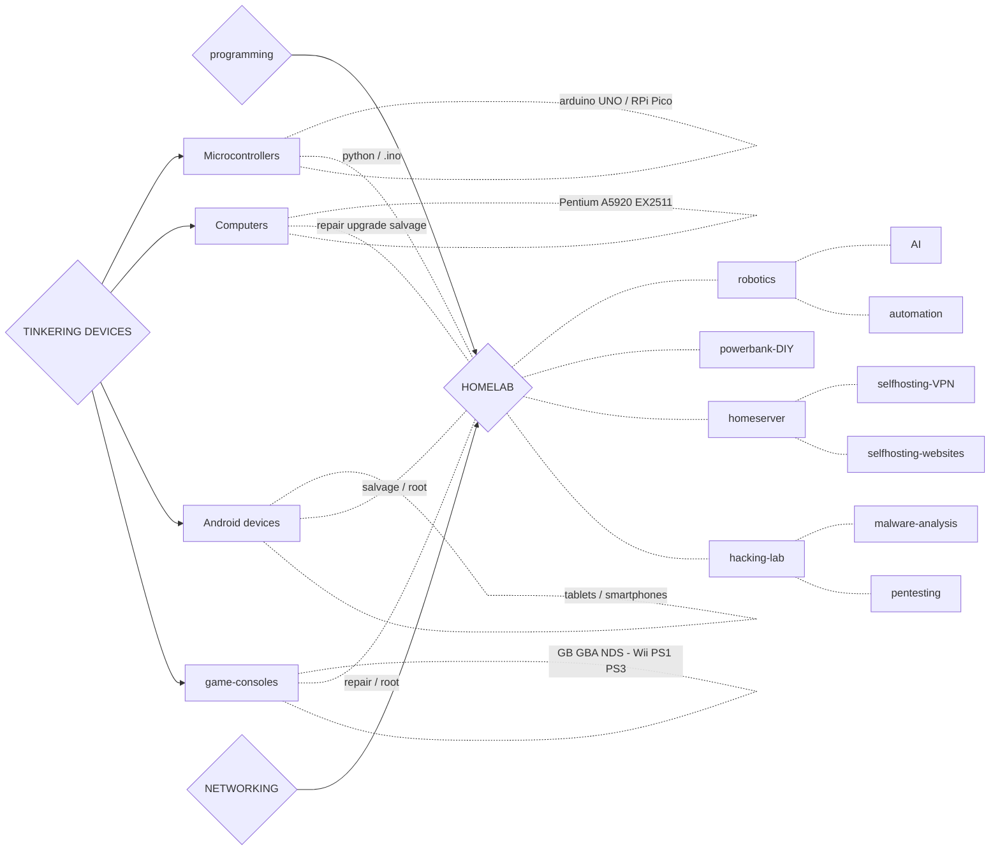
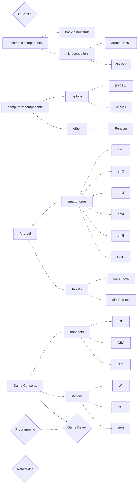

# Tinkering Devices

*10/11/2022*

Click to see graph n.1

Summary-graph copypasted from [SLIT-materials](/SLIT-materials.md):

Click to see graph n.2

Graph 2.0:

---

Current set of *devices* I own, may tinker with and salvage from:

|computers|tablets|smartphones|SBCs|MCs|GC-handheld|GC-stations|
|---|---|---|---|---|---|---|
|C01-GL76|T01-Supernova|S01-...||MC01-Elegoo_UNO|GB|Wii
|C02-EX2511|T02-A1337|S02-...||MC02-RPico|GBA|PS1
|C03-A5920||S03-...|||NDS|PS3
|C04-Pentium||S04-...||||

> General specs-chart might be here for as many devices as possible aye!

Click to see a draft for the 'specs-chart'

|C01-GL76|...|S02-nokia|...|
|---|---|---|---|
|manufacturer|
|model name|
|CPU|
|GPU|
|RAM|
|storage|
|battery|
|resolution|
|OS|
|fate|

