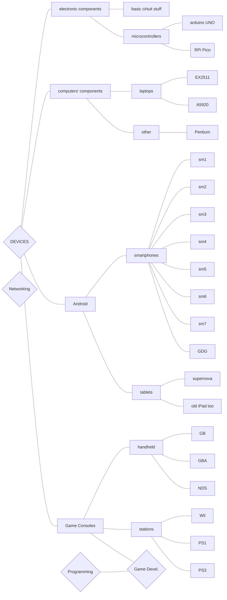

# Tinkering Devices

*10/11/2022*

Summary-graph copypasted from [SLIT-materials](/SLIT-materials.md):

Graph 2.0:

---
*first commit lmao*

Pulling data from local LinWin Obsidian documentation!

- [Tinkering Devices](#tinkering-devices)
  - [Tablets](#tablets)
    - [Supernova](#supernova)
    - [iPAD model A1337](#ipad-model-a1337)
  - [Smartphones](#smartphones)
  - [Computers & Components](#computers--components)
    - [Pentium](#pentium)
    - [A5920](#a5920)
    - [EX2511](#ex2511)
    - [GL76](#gl76)
  - [Microcontrollers](#microcontrollers)
    - [Arduino UNO (in fact *Elegoo*)](#arduino-uno-in-fact-elegoo)
    - [Raspberry Pi Pico](#raspberry-pi-pico)
  - [Game consoles](#game-consoles)
    - [GameBoy](#gameboy)
    - [GameBoy Advance](#gameboy-advance)
    - [PS1](#ps1)
    - [PS3](#ps3)
    - [Wii](#wii)

## Tablets
### Supernova
### iPAD model A1337

## Smartphones

## Computers & Components
### Pentium
### A5920

<!--pre-dissassemble-->

| component | about |
| --- | --- |
| Machine | Acer Aspire 5920
| BIOS | v1.3809
| CPU | Intel Core 2 Duo T8100 (2) @ 2.101GHz
| GPU | Intel Mobile GM965/GL960
| Memory |  ... / 4 GB (2 GB x 2)
| Storage | |
| Battery | | 
| Resolution | 1280x800
| OS-00 | Windows 7
| OS-01 | Pop!OS 22.04 

**Troubleshooting?**

**software performance**

lorem ipsum

### EX2511
### GL76

## Microcontrollers
### Arduino UNO (in fact *Elegoo*)
### Raspberry Pi Pico

## Game consoles
### GameBoy
### GameBoy Advance
### PS1
### PS3
### Wii

