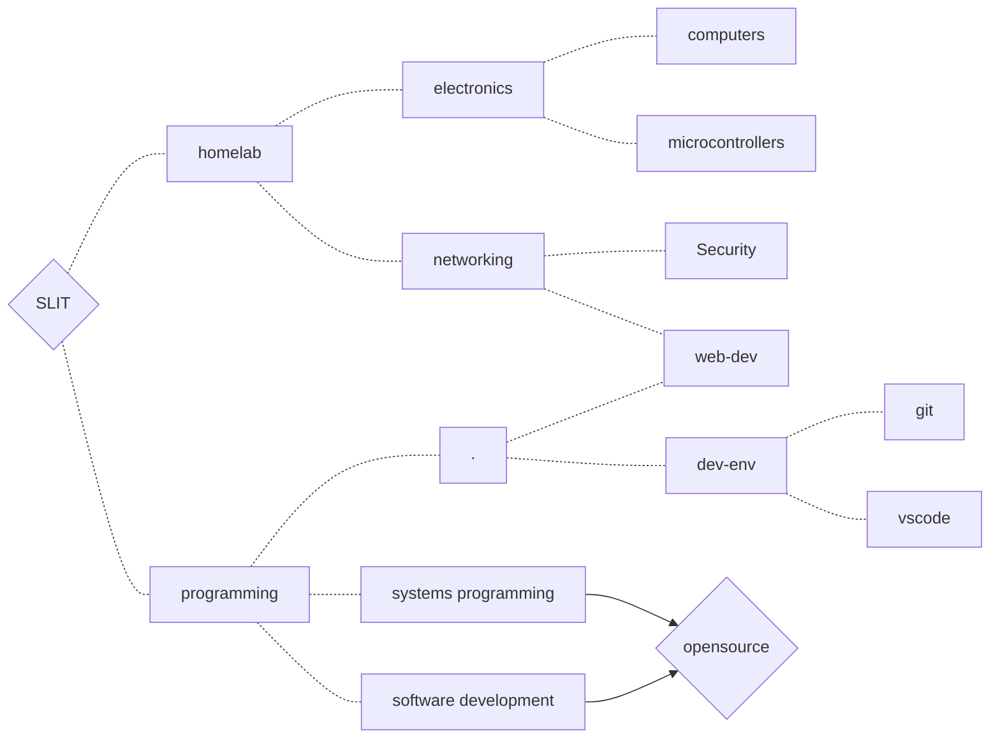
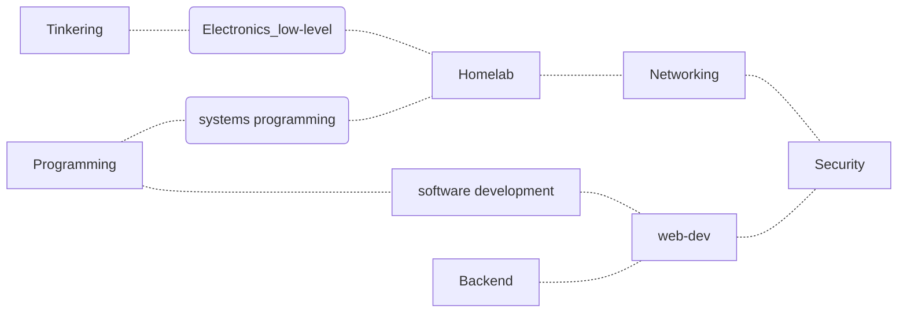

for example

```mermaid
flowchart LR;

SLIT{SLIT}

    pro[programming]

        sp[systems programming]


        sd[software development]


    H[homelab]


        E[electronics]

            C[computers]
            mc[microcontrollers]


        N[networking]

            S[Security]


SLIT .- H
    H .- E
        E .- C
        E .- mc
    H .- N
        N .- S
        N .- web-dev


SLIT .- pro
    pro .- .
        . .- web-dev
        . .- dev-env
            dev-env .- git
            dev-env .- vscode
    pro .- sp
    pro .- sd


        sp --> OS
        sd --> OS


OS{opensource}


```

```mermaid
flowchart LR;

Tinkering .- Electronics(Electronics_low-level)
    Electronics .- Homelab

    Homelab .- Networking
        Networking .- Security


Programming .- sp(systems programming)
    sp .- Homelab
Programming .- sd[software development]

    sd .- web-dev
        web-dev .- Security

Backend .- web-dev

```