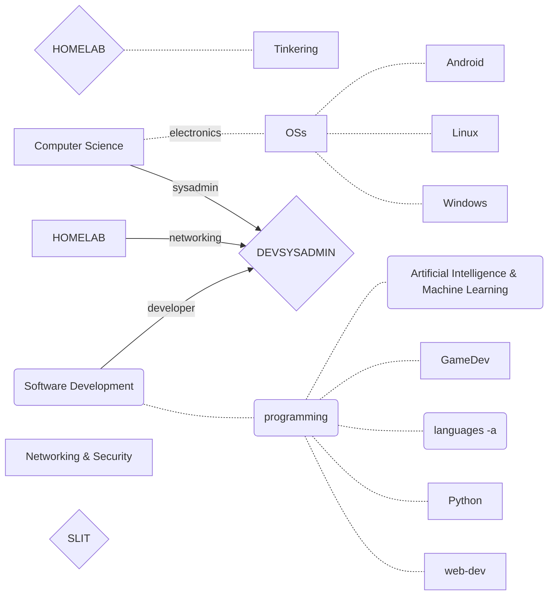
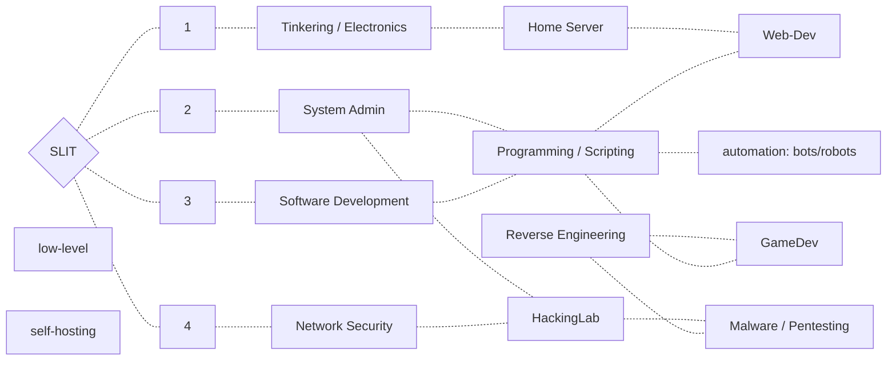

# DELETE: graphs-sandbox

- [DELETE: graphs-sandbox](#delete-graphs-sandbox)

1. ## from DEVSYSADMIN with HOMELAB to SLIT

2. ## BRAINSTORM

(1)

N .- HS

HS .- RE

RE .- GD
P .- GD

E .- N

HS .- M

T .- E

P .- WD
WD .- N
SD .- P

P .- A
P .- S
P .- AI
P .- Py

S .- A

E .- P

P .- OSs

(2)

HS .- MP
N .- HS
N .- WD
OA .- HS
OA .- PS
PS .- GD
PS .- MP
PS .- Py
PS .- RE
PS .- WD
Py .- WD
Py .- AI
RE .- GD
SD .- OA
SD .- PS
TE .- AI
TE .- N
TE .- OA
TE .- PS