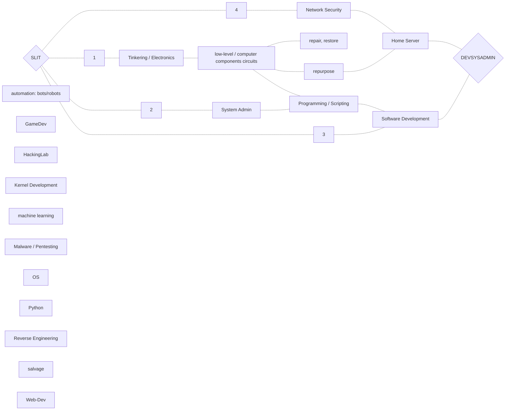
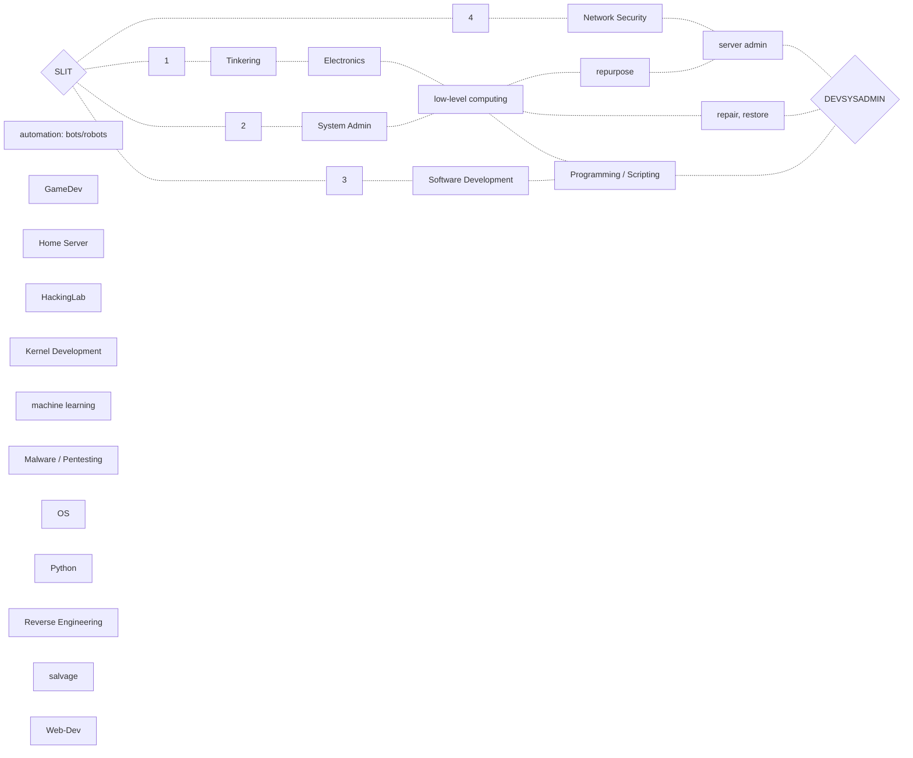
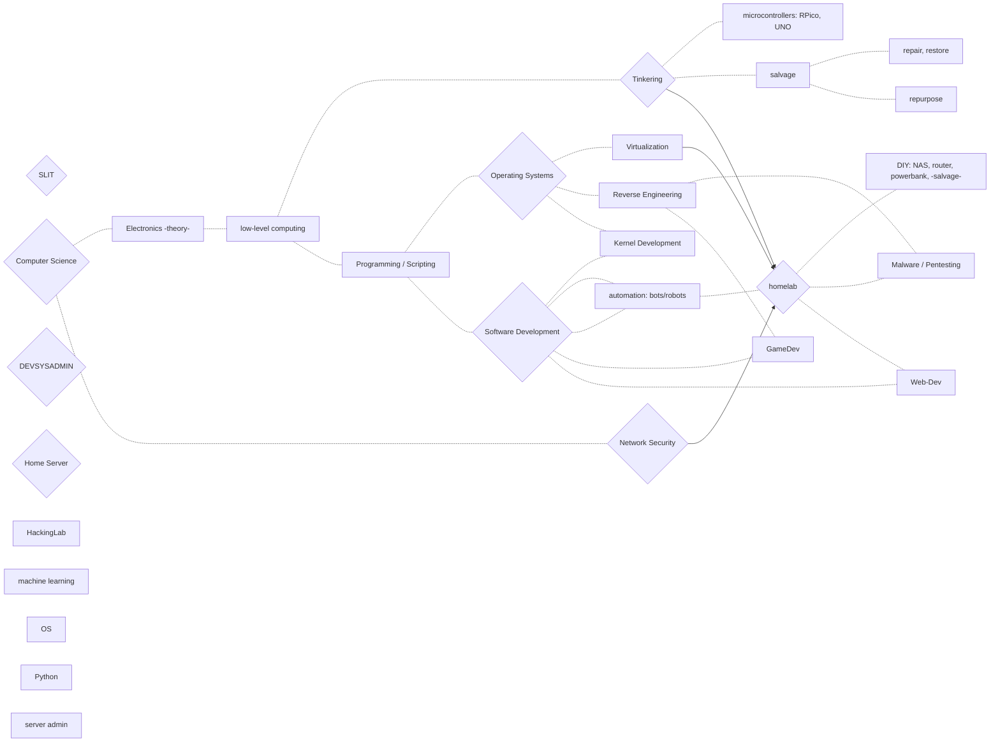
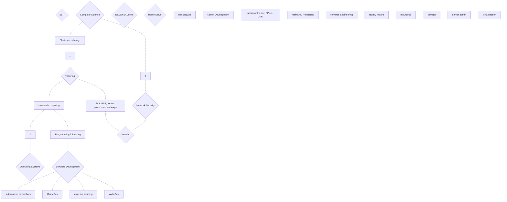
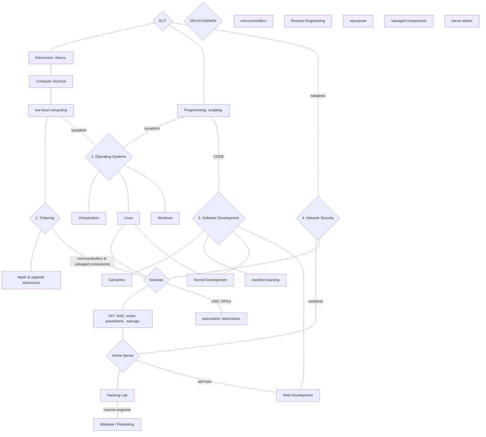
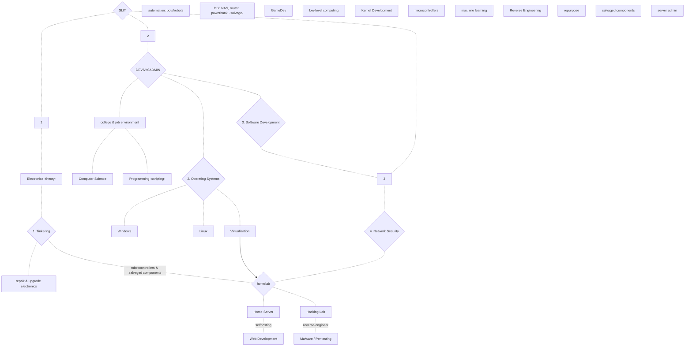

# DELETE: graphs-sandbox

- [DELETE: graphs-sandbox](#delete-graphs-sandbox)

1. ## from DEVSYSADMIN with HOMELAB to SLIT

2. ## DEVSYSADMIN

3. ## BRAINSTORM

4. ## pos-devsysadmin

5. ## TD beta ~~proper SD~~

6. ## TD more

7. ## good night ffs

