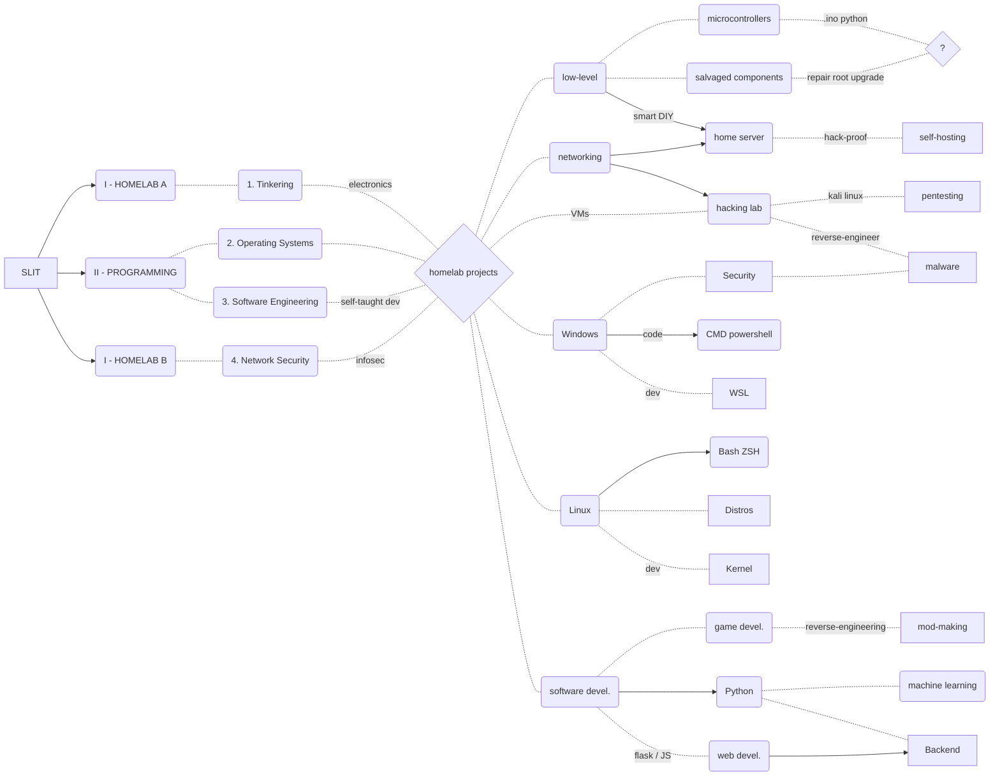
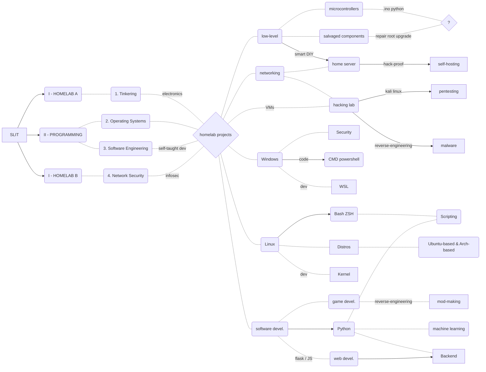
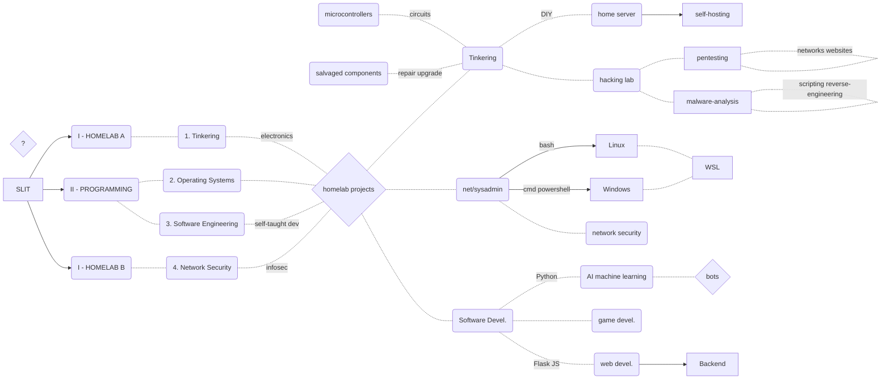

8. ## separated trunks

```mermaid
flowchart TD;

SLIT{SLIT}

AI[automation: bots/robots]
CS[Computer Science]
D{DEVSYSADMIN}
DIY[DIY: NAS, router, powerbank, -salvage-]
GD[GameDev]
E[Electronics -theory-]
LL[low-level computing]
homelab{homelab}
HS[Home Server]
HL[Hacking Lab]
KD[Kernel Development]
mc[microcontrollers]
ml[machine learning]
MP[Malware / Pentesting]
NS{4. Network Security}
PS[Programming -scripting-]
RE[Reverse Engineering]
repair[repair & upgrade electronics]
repurpose[repurpose]
SA{2. Operating Systems}
SC[salvaged components]
server[server admin]
SD{3. Software Development}
T{1. Tinkering}
V[Virtualization]
WD[Web Development]
?[college & job environment]

```

``` mermaid

graph LR;

?{?}

SLIT 

    SLIT --> IA(I - HOMELAB A)
        IA .- 1(1. Tinkering)
            1 .- |electronics| HP{homelab projects}

    SLIT --> II(II - PROGRAMMING)
        II .- 2(2. Operating Systems)
            2 .- HP

        II .- 3(3. Software Engineering)
            3 .- |self-taught dev| HP

    SLIT --> IB(I - HOMELAB B)
        IB .- 4(4. Network Security)
            4 .- |infosec| HP


HP

    HP .- LL(low-level)
        LL .- mc(microcontrollers)
        LL .- SC(salvaged components)
            mc .- |.ino python| ?
            SC .- |repair root upgrade| ?
            SC
        LL --> |smart DIY| HS(home server)
            HS .- |hack-proof| self-hosting

    HP .- N(networking)
        N --> HS
        N --> HL       


    HP .- |VMs| HL(hacking lab)
            HL .- |kali linux| pentesting
            HL .- |reverse-engineer| malware
            
    HP .- W(Windows)

        W .- Security
            Security .- malware
        W --> |code| CPS(CMD powershell)
        W .- |dev| WSL


    HP .- L(Linux)

        L --> Bash(Bash ZSH)
        L .- Distros
        L .- |dev| Kernel


    HP .- SD(software devel.)

        SD .- GD(game devel.)
            GD .- |reverse-engineering| mod-making
        SD --> PY(Python)
            PY .- ml(machine learning)
            PY .- Backend
        SD .- |flask / JS| WD(web devel.)
            WD --> Backend


```

``` mermaid

graph LR;

?{?}

SLIT 

    SLIT --> IA(I - HOMELAB A)
        IA .- 1(1. Tinkering)
            1 .- |electronics| HP{homelab projects}

    SLIT --> II(II - PROGRAMMING)
        II .- 2(2. Operating Systems)
            2 .- HP

        II .- 3(3. Software Engineering)
            3 .- |self-taught dev| HP

    SLIT --> IB(I - HOMELAB B)
        IB .- 4(4. Network Security)
            4 .- |infosec| HP


HP

    HP .- LL(low-level)
        LL .- mc(microcontrollers)
        LL .- SC(salvaged components)
            mc .- |.ino python| ?
            SC .- |repair root upgrade| ?
            SC
        LL --> |smart DIY| HS(home server)

    HP .- N(networking)
        N .- HS
            HS --> |hack-proof| self-hosting
        N .- HL       


    HP .- |VMs| HL(hacking lab)
            HL --> |kali linux| pentesting
            HL --> |reverse-engineering| malware
            
    HP .- W(Windows)

        W .- Security
        W --> |code| CPS(CMD powershell)
        W .- |dev| WSL


    HP .- L(Linux)

        L --> Bash(Bash ZSH)
            Bash .- S(Scripting)
        L .- Distros
            Distros .- distros(Ubuntu-based & Arch-based)
        L .- |dev| Kernel


    HP .- SD(software devel.)

        SD .- GD(game devel.)
            GD .- |reverse-engineering| mod-making
        SD --> PY(Python)
            PY .- S
            PY .- ml(machine learning)
            PY .- Backend
        SD .- |flask / JS| WD(web devel.)
            WD --> Backend


```

``` mermaid

graph LR;

?{?}

SLIT 

    SLIT --> IA(I - HOMELAB A)
        IA .- 1(1. Tinkering)
            1 .- |electronics| HP{homelab projects}

    SLIT --> II(II - PROGRAMMING)
        II .- 2(2. Operating Systems)
            2 .- HP

        II .- 3(3. Software Engineering)
            3 .- |self-taught dev| HP

    SLIT --> IB(I - HOMELAB B)
        IB .- 4(4. Network Security)
            4 .- |infosec| HP


HP

        mc(microcontrollers) .- |circuits| T
        SC(salvaged components) .- |repair upgrade|T

    HP .- T(Tinkering)
            mc
            SC

            T .- |DIY| HS(home server)
                HS --> self-hosting


            T .- HL(hacking lab)
                HL .- pentesting .- |networks websites| pentesting
                HL .- malware-analysis .- |scripting reverse-engineering| malware-analysis


    HP .- NSA(net/sysadmin)

        NSA --> |bash| Linux
            Linux .- WSL
        NSA --> |cmd powershell| Windows
            Windows .- WSL
        NSA .- NS(network security)
            NS


    HP .- SD(Software Devel.)

        SD .- |Python| AI(AI machine  learning)
            AI .- bots{bots}
        SD .- GD(game devel.)
        SD .- |Flask JS| WD(web devel.) --> Backend


```

``` mermaid

graph LR;

?{?}

SLIT 

    SLIT --> IA(I - HOMELAB A)
        IA .- 1(1. Tinkering)
            1 .- |electronics| HP{homelab projects}

    SLIT --> II(II - PROGRAMMING)
        II .- 2(2. Operating Systems)
            2 .- HP

        II .- 3(3. Software Engineering)
            3 .- |self-taught dev| HP

    SLIT --> IB(I - HOMELAB B)
        IB .- 4(4. Network Security)
            4 .- |infosec| HP


HP

        mc(microcontrollers) .- |circuits| T
        SC(salvaged components) .- |repair upgrade|T

    HP .- T(Tinkering)
            mc
            SC

            T .- |DIY| HS(home server)
                HS --> self-hosting


            T .- HL(hacking lab)
                HL .- pentesting .- |networks websites| pentesting
                HL .- malware-analysis .- |scripting reverse-engineering| malware-analysis


    HP .- NSA(net/sysadmin)

        NSA --> |bash| Linux
            Linux .- WSL
        NSA --> |cmd powershell| Windows
            Windows .- WSL
        NSA .- NS(network security)
            NS


    HP .- SD(Software Devel.)

        SD .- |Python| AI(AI machine  learning)
            AI .- bots{bots}
        SD .- GD(game devel.)
        SD .- |Flask JS| WD(web devel.) --> Backend


```