8. ## separated trunks

```mermaid
flowchart TD;

SLIT{SLIT}

AI[automation: bots/robots]
CS[Computer Science]
D{DEVSYSADMIN}
DIY[DIY: NAS, router, powerbank, -salvage-]
GD[GameDev]
E[Electronics -theory-]
LL[low-level computing]
homelab{homelab}
HS[Home Server]
HL[Hacking Lab]
KD[Kernel Development]
mc[microcontrollers]
ml[machine learning]
MP[Malware / Pentesting]
NS{4. Network Security}
PS[Programming -scripting-]
RE[Reverse Engineering]
repair[repair & upgrade electronics]
repurpose[repurpose]
SA{2. Operating Systems}
SC[salvaged components]
server[server admin]
SD{3. Software Development}
T{1. Tinkering}
V[Virtualization]
WD[Web Development]
?[college & job environment]

```





``` mermaid

graph LR;

SLIT 


    SLIT --> IA(I - HOMELAB A)
        IA .- 1(1. Tinkering)
            1 .- homelab{homelab}


    SLIT --> II(II - PROGRAMMING)
        II .- 2(2. Operating Systems)


        
        II .- 3(3. Software Engineering)


    SLIT --> IB(I - HOMELAB B)
        IB .- 4(4. Network Security)
            4 .- homelab
    