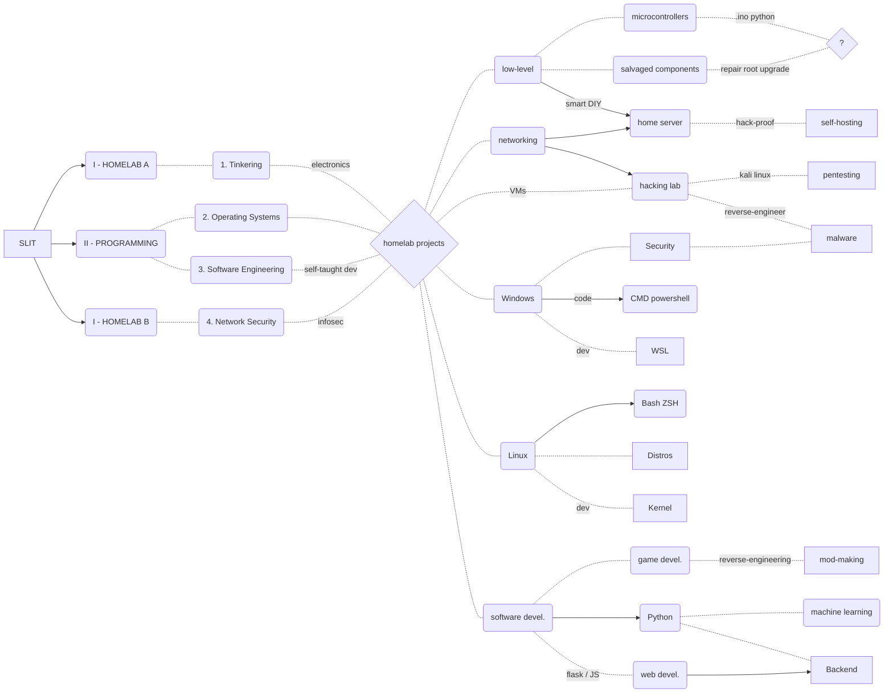
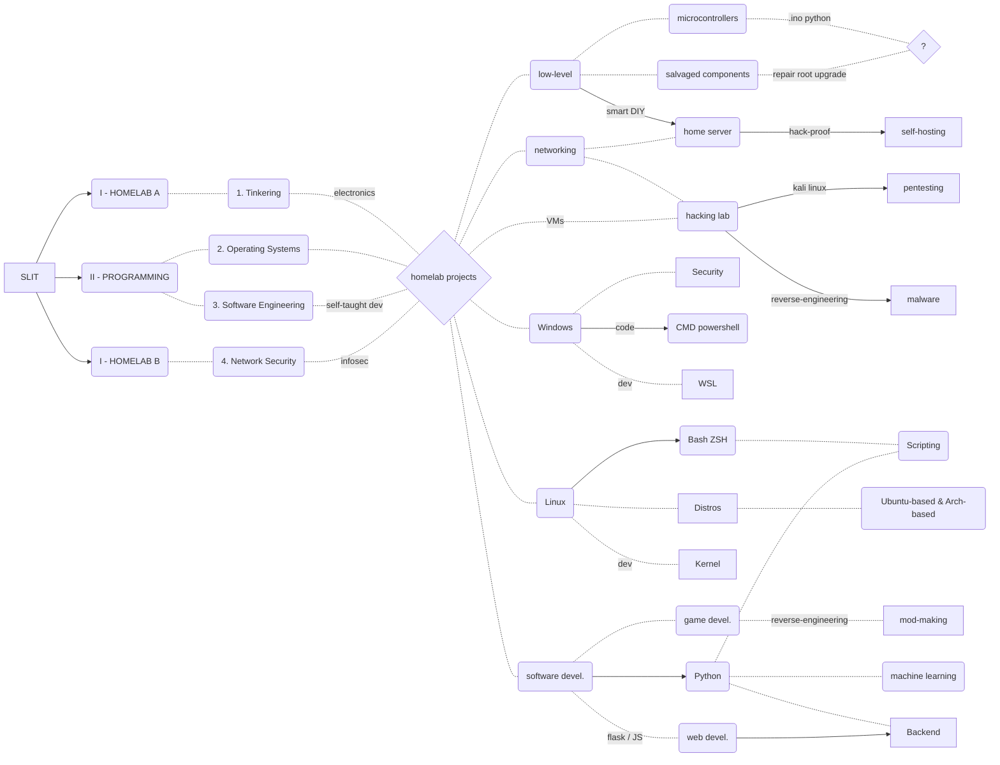
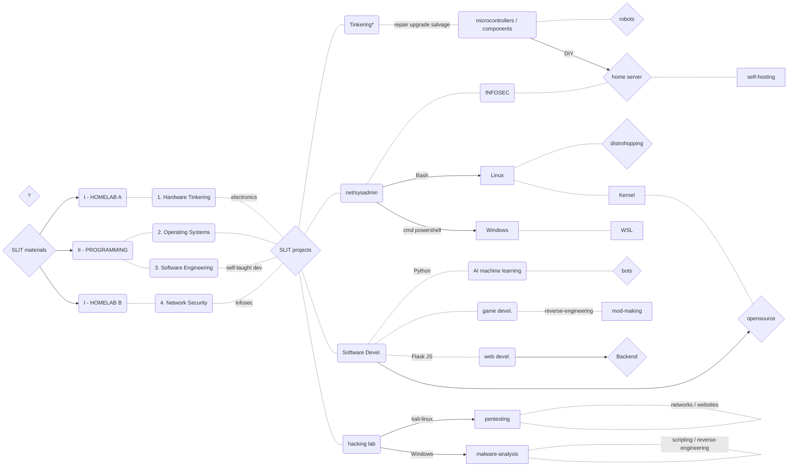
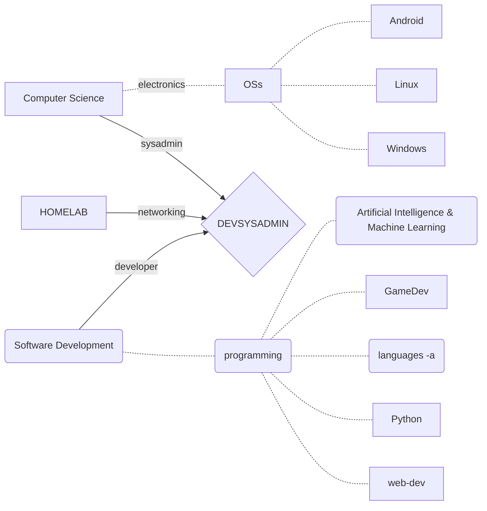
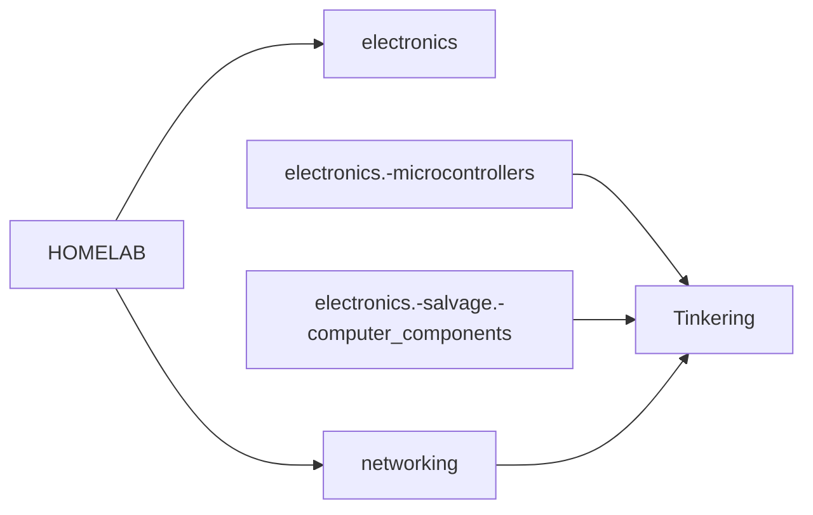

8. ## separated trunks

```mermaid
flowchart TD;

SLIT{SLIT}

AI[automation: bots/robots]
CS[Computer Science]
D{DEVSYSADMIN}
DIY[DIY: NAS, router, powerbank, -salvage-]
GD[GameDev]
E[Electronics -theory-]
LL[low-level computing]
homelab{homelab}
HS[Home Server]
HL[Hacking Lab]
KD[Kernel Development]
mc[microcontrollers]
ml[machine learning]
MP[Malware / Pentesting]
NS{4. Network Security}
PS[Programming -scripting-]
RE[Reverse Engineering]
repair[repair & upgrade electronics]
repurpose[repurpose]
SA{2. Operating Systems}
SC[salvaged components]
server[server admin]
SD{3. Software Development}
T{1. Tinkering}
V[Virtualization]
WD[Web Development]
?[college & job environment]

```













```markdwon

# SLIT materials

1. ## Hardware Tinkering

2. ## Operating Systems

3. ## Software Engineering

4. ## Network Security

# SLIT homelab projects

1. ## Tinkering

### microcontrollers > robots

### salvaged components > (DIY) home server > (infosec) self-hosting

2. ## netsysadmin

### Linux > Bash

### Linux > distros

### Windows > WSL


4. ## INFOSEC

### hacking lab > malware analysis

### hacking lab > pentesting

```

---

# previously in SLIT readme


1. ## SLIT graph

```mermaid

graph LR;


SLIT{SLIT}

SLIT --> T
T[Tinkering]
T.- |security| N
T .- |repair-salvage| E


E[electronics]
E .- |smart DIY| H
N[networking]
N .- |NAS| H


H{HOMELAB}
H .- |robotics| automation
H .- |malware| hacking-lab
H .- |self-hosting| home-server
H --> 2022


2022{pabloqpacin 2022+}
D --> 2022
D{DEVSYSADMIN}
D .- |Python| AI(artificial intelligence)
D .- |reverse engineering| game(gamedev/modding)
D .- |frameworks| web-dev


SLIT --> P
P[Programming]
sysadmin[sysadmin]
SD[software dev.]


P .- |OS config| sysadmin
P .- |languages| SD

sysadmin .- |shell dev.| D
SD .- |backend| D


```


2. ## ↓ DEVSYSADMIN




3. ## ↑ HOMELAB-short



4. ## ↑ HOMELAB-long


5. ## ↑ HOMELAB-devices


# *SLIT-materials* taglist(rows)

